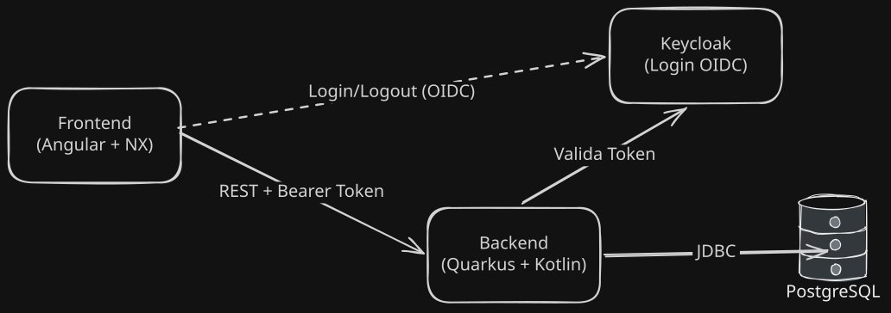
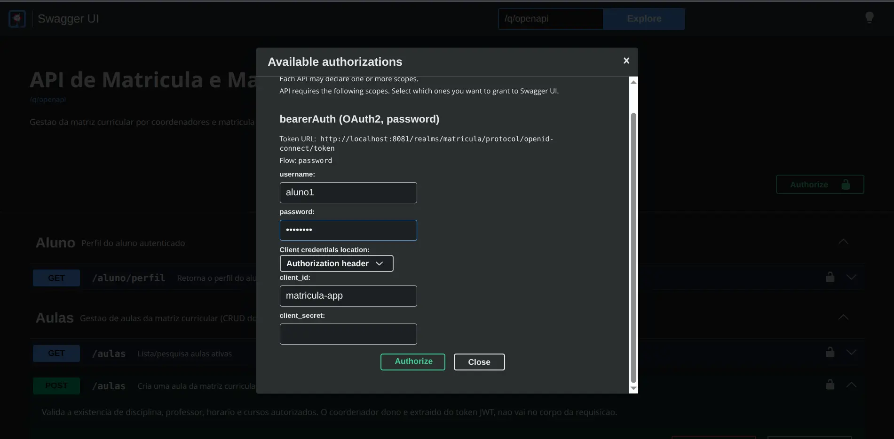

# Hilton Case Técnico

Desafio técnico - Desenvolvedor Unifor

Sistema de gestão de matriz curricular e matrícula onde coordenadores criam e gerenciam a matriz curricular (disciplina, professor, horário, vagas), alunos se
matriculam nas aulas do próprio curso.

Documento com o que é pedido no desafio técnico esta em [docs/desafio-tecnico-unifor](docs/desafio-tecnico-unifor.pdf).

## Stack

- **Backend:** Kotlin, Quarkus, Panache (JPA/Hibernate),  Flyway, PostgreSQL, OIDC (Keycloak)
- **Frontend:** Angular, Nx, RxJS, PrimeNG, keycloak-angular
- **Infra:** Docker Compose, GitHub Actions (CI)

<p align="center">
  
</p>

Decisões técnicas e simplificações adotadas estão documentadas em
[docs/DECISIONS](docs/DECISIONS.md).

## Pré-requisitos

- Docker e Docker Compose

## Comando para subir aplicação

```bash
docker compose up --build
```

Sobe os 4 serviços (Postgres, Keycloak, backend, frontend) com esse comando. 
O Keycloak importa o realm automaticamente na primeira subida (usuários de teste já inclusos, ver abaixo).

## URLs de acesso

| Serviço | URL |
|---|---|
| Frontend | http://localhost:4200 |
| Backend | http://localhost:8080 |
| Swagger UI | http://localhost:8080/q/swagger-ui |
| Keycloak | http://localhost:8081 |

## Documentação da API

A documentação completa de todos os endpoints, com método HTTP, parâmetros, payloads
de request/response e os possíveis códigos de erro, está no Swagger UI (http://localhost:8080/q/swagger-ui), gerada automaticamente a partir de anotações
OpenAPI (`@Operation`, `@APIResponses`, `@Parameter`) no código de cada endpoint. Abrindo qualquer endpoint no Swagger dá pra ver o payload de exemplo da
requisição, testar a chamada direto pela UI (usando o botão "Authorize" com um nome de usuário e senha) e conferir todos os status codes possíveis de resposta.

<p align="center">
  
</p>

Abaixo deixo alguns usuários criados para teste, onde basta entrar com nome do usuário (username) e senha para executar os endpoints no Swagger.

## Usuários de teste

Perfis pré-cadastrados no Keycloak:

| Usuário | Senha | Perfil | Curso |
|---|---|---|---|
| `aluno1` | `aluno123` | Aluno | Ciência da Computação |
| `aluno2` | `aluno123` | Aluno | Ciência da Computação |
| `aluno3` | `aluno123` | Aluno | Engenharia de Software |
| `coordenador1` | `coord123` | Coordenador | — |
| `coordenador2` | `coord123` | Coordenador | — |

## Como rodar os testes

**Backend** (testes unitários e de endpoint com
JUnit5/MockK/RestAssured):

```bash
cd backend
./gradlew test
```

Não precisa de nenhuma infraestrutura externa rodando: os testes que dependem de
banco sobem um PostgreSQL via Testcontainers automaticamente (ver
[docs/DECISIONS.md](docs/DECISIONS.md)). Se o container `backend` do
`docker compose` já estiver rodando na porta 8080, pare-o antes
(`docker compose stop backend`) pra evitar conflito de porta.

**Frontend** (usa Vitest):

```bash
cd frontend
yarn install
yarn nx run-many -t test --all
```

Cobre testes de componente nas duas telas principais: validação de formulário e
exclusividade dos filtros da matriz curricular na tela do coordenador; escopo de
aulas disponíveis por curso, cálculo de matrícula ativa e tratamento de erro na tela
do aluno.

## Contato

- Email: [jhilton930@gmail.com](mailto:jhilton930@gmail.com)
- GitHub: [github.com/jhiltonsantos](https://github.com/jhiltonsantos)
- LinkedIn: [linkedin.com/in/hiltonsantos9](https://linkedin.com/in/hiltonsantos9)
- Portfólio: [hiltondev.site](https://www.hiltondev.site)